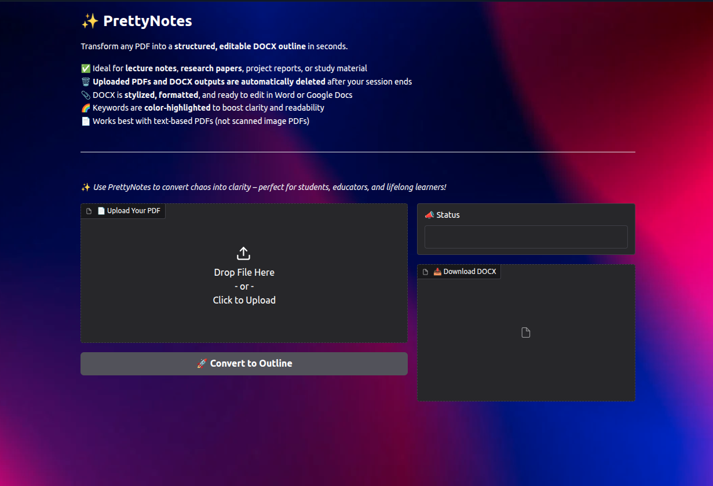
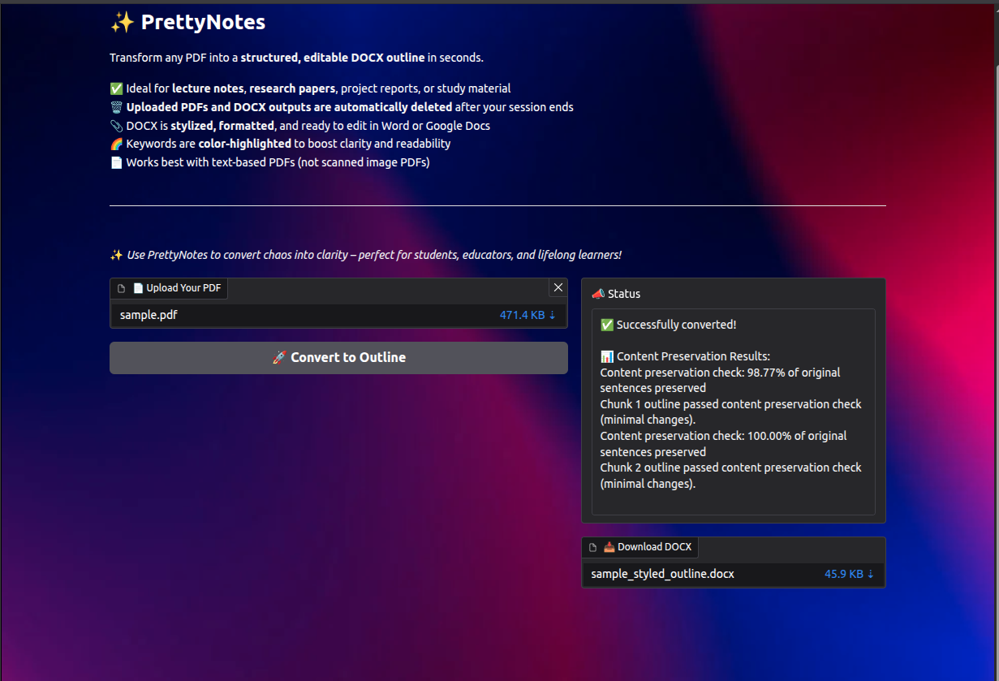
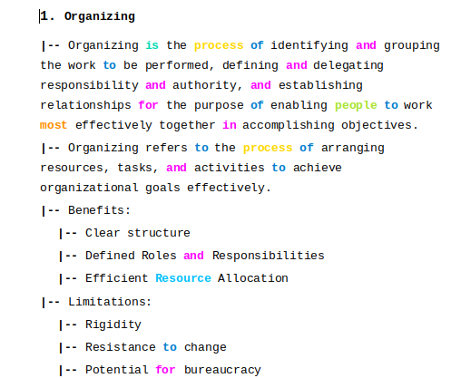

# ✨ PrettyNotes

Tired of skimming through unstructured PDFs or manually reformatting study material? **PrettyNotes** helps you turn cluttered PDFs into neat, editable DOCX outlines — complete with bullet hierarchies, clean formatting, and color-coded keywords.

Whether you're dealing with lecture notes, research papers, or documentation, PrettyNotes ensures the **original content stays untouched** — just better organized and easier to work with.

> Upload a PDF. Get a structured Word doc. No fluff, no rewriting — just clean formatting.


## 🚀 Features

- ✅ Converts PDFs into **structured outlines** (DOCX)
- 🔒 **Strict content preservation** – no paraphrasing or summarizing
- 🌈 **Color-coded keywords** for better readability
- 📝 Outputs are **fully editable** in Word or Google Docs
- 🗑️ Temporary files auto-cleaned after each session
- 🖥️ Built with **Gradio** UI and **Gemini 1.5 Flash**


## 📸 Preview



*Interface of the Website*

*Output of the PDF with overall accuracy statistics provided*

*Generated DOCX Output*


## Tech Stack

- **Python** (backend logic)
- **PyMuPDF** for PDF text extraction
- **Gemini API** for LLM-based formatting
- **python-docx** to generate styled Word files
- **Gradio** for web-based UI


##  Local Setup

```bash
git clone https://github.com/your-username/PrettyNotes.git
cd PrettyNotes
pip install -r requirements.txt
```
Create a .env file in the root directory:
```
GEMINI_API_KEY=your_gemini_key_here
```

Then run:
```
python app.py
```

## Output Example
When you upload sample.pdf, the output is:

A sample_styled_outline.docx file

Hierarchical bullets (e.g., 1., |--)

Highlighted words like if, process, development

Fonts: Courier New for better code-style clarity

## ⚠️ Notes
- Doesn’t work with scanned image-based PDFs

- All temporary DOCX files are cleaned automatically

- Gemini is used strictly for formatting, not rewriting

## Why PrettyNotes?
Because manually reformatting PDF content is time-consuming. PrettyNotes automates the job without messing up your content—perfect for students, educators, and researchers.

